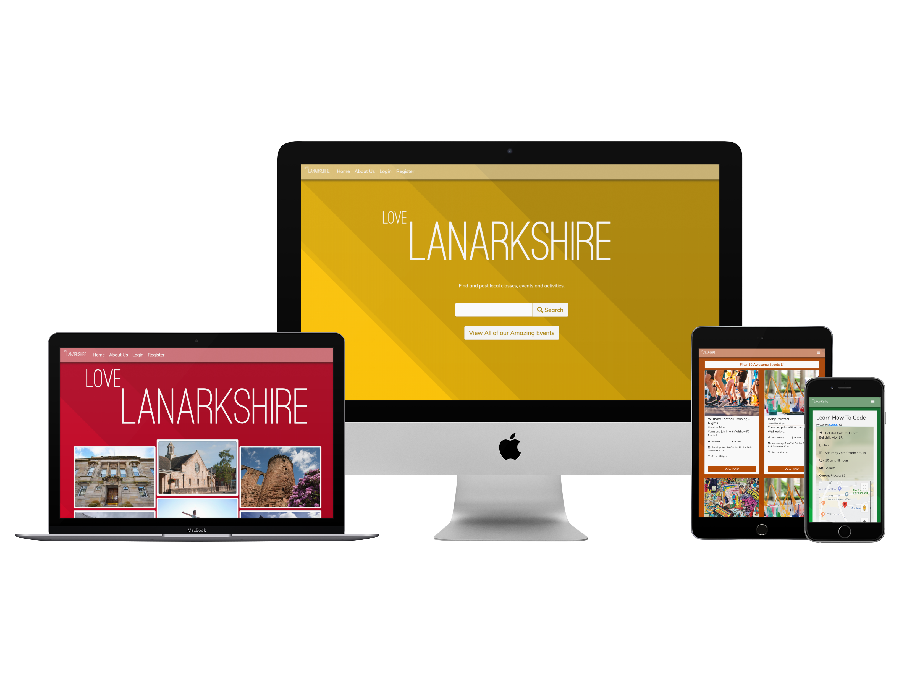
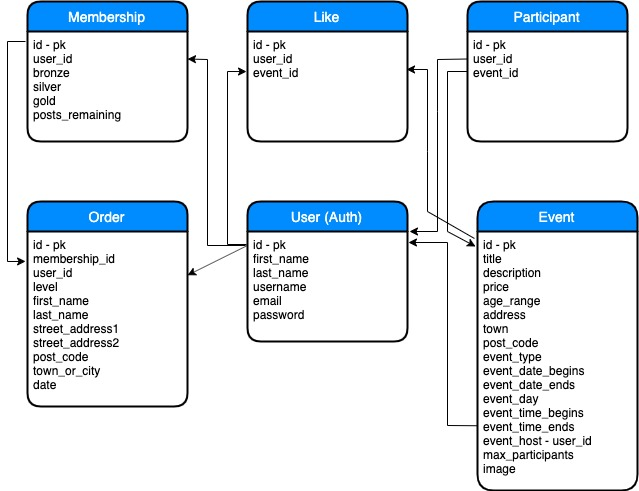

# Love Lanarkshire




Welcome to Love Lanarkshire - a web application that brings local communities together, allowing users to share their interests, hobbies and expertise with others in their local area. The site features a robust relational database hosted with PostgresSQL and a backend code devleoped with Python and the Django framework. This enables users to upload and view a variety of event details, interact with specific events and filter and search through the event database. The frontend was developed with HTML, CSS and JS and displays all events in a responsive, intuitive and coherent design. Registered users can perform CRUD operations on their own details or the events they have listed. Registered users have the ability to upgrade their membership of the site and this is facilitated by Stripe payments.

View the deployed site [here](https://love-lanarkshire-ms4.herokuapp.com).


| Contents  |
|-----------|
|[UX](#UX) |
|[Features](#Features)|
|[Testing](#Testing)|
|[Deployment](#Deployment)|
|[Credits](#Credits)|

### UX
___

#### Strategy

The site should...

* be visually appealing - using colours, styles and fonts which reflect the style and ethos of the brand
* provide quick access to the database of events
* enable the user to search for events by keywords
* enable the user to filter their search results
* enable users to change their details in the database
* enable users to change their membership status (posting privileges) by completing a one-time payment
* enable users to post/delete and edit events in the database
* enable users to like and join events

For the user the site should...

* be intuitive and easy to use
* be personalised and welcoming
* be responsive and accessible on a range of screens and devices
* provide quick access to events with a very simple search and filter function
* look appealing and in keeping with the brand
* ensure their data is secure
* allow them to manage their own events and user data
* allow them to keep their favourite(liked) events


##### User Stories

* As a bronze (free tier) user... 
    1. As a user, I want quick access to a variety of events based on my location
    2. As a user, I want quick access to a variety of events based on my interests
    3. As a user, I want quick access to a variety of events based on my age range
    4. As a user, I want to be able to book a place on an event
    5. As a user, I want to be able to save the events that I think I will like
    6. As a user, I want to see an overview of my upcoming booked classes
    7. As a user, I want to see the exact location of my event
    8. As a user, I want to be able to easily make changes to the data stored in my profile
* As silver/ gold (paid tier) user...
    1. As a user, I want to manage my membership, upgrading or changing it with ease and instant clarification of any changes
    2. As a user, I want to be able to post events providing event specific information that will appeal to the users who will enjoy my event most
    3. As a user, I want to be able to edit and delete events that I've posted
    4. As a user, I want to be able to upload specific event-related photographs that will help users find my event
    5. As a user, I do not want my event to be over-subscribed
    6. As a user, I want to know how many people to expect at my event

#### Scope

In order to create a good UX Love Lanarkshire should...

* be developed with a mobile-first approach in order to suit the widest possible audience
* be responsive in order to display correctly across a range of devices. A quick overview of [current browser stats](https://www.w3counter.com/globalstats.php) reveals that whilst Chrome is by far the most popular browser by far, the top 3 screen resolutions were 640x360, 1920x1080 and 1366x768 therefore it is essential to support a range of screens.
* be intuitive and provide feedback to the user on their actions
* feature a cohesive and distinctive design which promotes the Love Lanarkshire brand
* have a simple and easy to use search interface with filters
* enable users to instantly increase the functionality they receive with a one-time payment
* be functional to any user, whether logged in or not, but provide extra functionality and personalisation to registered users and differing membership levels

Please find my initial wireframe and database schema, created using Balsamiq, [here](development/LL-wireframes.pdf)


### Features
___

#### Existing Features

> Navigation Bar/ Dropdown Menu

Bootstrap 4 creates a minimalist navigation bar that toggles a dropdown menu on mobile/tablet devices. A user should not have to use the browser's back-button as the navigation bar is fixed, it will also fade to opaque when in use to increase the contrast of the text 

> Personalisation of Theme - FAB Button

A FAB button allows users to personalise their Love Lanarkshire experience. They can choose the colour theme of the site, setting their preference to local storage which will be remembered on their next visit.

> Main Search Box

For ease of use and in line with good UX design, there is a minimal search interface on the index page.

> Filter Accordion on Search Results

As some users may not be sure what they are looking for immediately and may like to initially browse the database, having extra filters on the search results page would prevent users from having to navigate back to the search box. 

> Bootstrap 4 grid layout and cards

Bootstrap styling ensures that the search results page would remain as responsive as possible. Using the card format ensures that key information is displayed in a way that is quick to see for the user. Each event can then be viewed for more information.

> Django Easy Maps and Google Maps API

Using a plugin called Django Easy Maps Love Lanarkshire will populate and display the correct location for each event in a Google Map. 

> User Register and Login with Password Reset Function using Django Authentication

Users can register and login to Love Lanarkshire with their password being encrypted when it is entered into the database. If a user forgets their password they can reset it through a personalised email link.

> User Profile Page

This is essentially a user dashboard that houses all of the most crucial user functionality for the Love Lanarkshire website. It is personalised to the user and allows them to update their details, upgrade their membership to the site, view their upcoming events, view their event history, view events they have liked and, dependant on their membership, allow them to post new events.

> Stripe Payments for Membership Upgrade

Using the Stripe API and plugin means that users can have confidence in submitting their payment details to Love Lanarkshire. It also means that Stripe will handle all verification and encryption of user payment details ensuring that Love Lanarkshire can keep their user details safe.


#### Features for the Future

> Pagination

Pagination on the search results will be essential as the database grows.

> Automation

Automation of some services would improve functionality as the user base increases - emails could alert event hosts when users book their event, emails could be sent to remind users of an upcoming event for which they are booked.

> Terms and Conditions

There would need to be a robust terms agreement for using the website - this would protect users against fraud and ensure the site is safe and secure for everyone.

> Post Event Form Location

Using current location or allowing hosts to choose their event location on a map may increase ease of use.

> Ratings

Creating a ratings system would improve accountability for hosts and users ensuring that Love Lanarkshire retains its community ethos.

> More Dynamic Event Status

As site usage increases users may like to see event status on the search page, this would involve marking fully booked events or ending soon events. There may also be an opportunity to 'feature' some events either for gold membership or a small fee.

> Further range of testing suites

As site usage expands so will the requirement for a range of tests to ensure new features can be added without breaking the site.


### Technologies Used

##### Languages

* **HTML** - used for creating content and basic layout and validated with W3C
* **CSS** - used for customised styling and layout and validated with W3C
* **JavaScript** - used to provide interactivity and logic to the client-side and manipulation of the DOM
* [Python](https://www.python.org/) - used to handle the logic for the site and provide connectivity between the database and the frontend


##### Frameworks

* [Django](https://www.djangoproject.com/) - A Python framework that provides templating logic, support for database modelling, easy-to-implement model forms, an integrated testing suite, an admin panel and secure authentication
* [Bootstrap](https://getbootstrap.com/) - used for responsive layout, basic styling, dropdown Navbar (JavaScript for these features was used - linked to Bootstrap and, through BS, popper.js in <script> tags)

##### Tools

* [Coverage.py](https://pypi.org/project/coverage/) - A tool which measures code coverage during test execution
* [TravisCI](https://docs.travis-ci.com/user/for-beginners/) - supports the development process by automatically building and testing code changes, providing immediate feedback on the success of the change
* [Django Crispy Forms](https://django-crispy-forms.readthedocs.io/en/latest/) - styles Django Model Forms with Bootstrap
* [Django Easy Maps](https://pypi.org/project/django-easy-maps/) - used to integrate the Google Maps API with Django and Python, also installs [Django App Conf](https://pypi.org/project/django-appconf/), [Django Classy Tags](https://pypi.org/project/django-classy-tags/), [Geographic Lib](https://pypi.org/project/geographiclib/), [Geopy](https://pypi.org/project/geopy/) and [Six](https://pypi.org/project/six/) as dependencies
* [Django Bootstrap Datepicker Plus](https://pypi.org/project/django-bootstrap-datepicker-plus/) - provided a styled datepicker tool for the post event form
* [DJ Database URL](https://pypi.org/project/dj-database-url/) - provides Django with a database connection dictionary
* [Psycopg2](https://pypi.org/project/psycopg2/) - Postgres database adaptor for Python
* [SQlite](https://www.sqlite.org/index.html) - relational database used for development
* [PostgresSQL](https://www.postgresql.org/) - relational database used for deployed site
* [Boto3](https://pypi.org/project/boto3/), [Botocore](https://pypi.org/project/botocore/) and [S3 Transfer](https://github.com/boto/s3transfer) - used to host and upload static and media files in S3 Buckets
* [S3 Buckets](https://docs.aws.amazon.com/AmazonS3/latest/dev/UsingBucket.html) - used to host static and media files
* [Stripe](https://stripe.com) - API used to create payment element and take secure payments
* [Gunicorn](https://gunicorn.org/) - a Python WSGI HTTP Server
* [Favicon.io](https://favicon.io/emoji-favicons/growing-heart/) - generates a Favicon
* [W3C Validator](https://validator.w3.org/) - HTML Validator 
* [W3C CSS Validator](https://jigsaw.w3.org/css-validator/) - CSS Validator
* [PyCodeStyle](https://pypi.org/project/pycodestyle/) - Python Validator
* [JSLint](https://www.jslint.com/) - JS Validator
* [AWS Cloud9 IDE](https://www.awseducate.com/student/s/awssite) - Cloud-based IDE 
* **Git** - used for version control
* [Heroku](https://heroku.com/) - deployed finished site through Heroku
* [Chrome Developer Tools](https://developers.google.com/web/tools/chrome-devtools/) - used to test and check the site throughout the development process
* [Balsamiq](https://balsamiq.com/) - used to create wireframes
* [CanIUse](https://caniuse.com/) - checks compatibility across Browsers
* [BrowserStack](https://www.browserstack.com/) - tests rendering across Browsers

##### Libraries

* [jQuery](https://jquery.com/) - JavaScript library used to connect with APIs and custom-code for the site which allows for DOM manipulation
* [Google Fonts](https://fonts.google.com/) - used for customised fonts
* [Ostrich Sans](https://www.fontsquirrel.com/fonts/ostrich-sans) - used for site title
* [Font Awesome](https://fontawesome.com/) - used for links and icons to make the site more appealing
* [Animate.css](https://daneden.github.io/animate.css/) - used for nav link hover effect
* [Textillate](https://textillate.js.org/) and [Lettering.JS](http://letteringjs.com/) - used to create site title effects


### Testing
___

#### Manual and Automated Testing

Manual testing was done for all CRUD operations from the database as well as for all links, buttons and forms in the site. I used Django's Debugger throughout the development process to immediately flag errors

Using Django's TestCase I created tests for individual component parts of the site. This allowed me to test the forms and views would or were rendering and functioning correctly. This worked in conjunction with Coverage.py which gave an indication for parts of the app that had not been tested.

Throughout the process I engaged continuous manual testing, using Chrome Developer Tools to view real time changes ensuring my site was responsive and functioned in all screen sizes and that my styling was applied appropriately throughout. 

I set ```console.logs``` and ```debugger``` statements throughout my js files in order to debug through the console.

I used ```print()``` statements in Python to ensure that data was being handled in the manner it was supposed to be.

I used jQuery to manipulate the DOM in Chrome Developer Tools in order to test my code visually before writing it within the script.

I had several users log in and out of the website searching, adding, editing and deleting (CRUD) events. This was to ensure that only registered users were able to delete/edit their own events.


Test it...

There is a test account available on Love Lanarkshire to show the full functionality of the site...

```
Username = TestUser
Password = PassTest!

```

There are also test cards for testing the Stripe payments in membership upgrade on the user's profile page...

```
Successful Card
    card number: 4242 4242 4242 4242
    CVC: Any 3 digit number
    Expiry: Any date in the future
    Zip Code: A 5 digit number
    
Declined Card
    card number: 4000 0000 0000 0002
    CVC: Any 3 digit number
    Expiry: Any date in the future
    Zip Code: A 5 digit number
    
Failed CVC 
    card number: 4000 0000 0000 0127
    CVC: Any 3 digit number
    Expiry: Any date in the future
    Zip Code: A 5 digit number
```

#### Responsiveness

I tested my project throughout development using Chrome Developer Tools to check the site was responsive. I continually made adjustments to my media-queries in CSS to ensure it looked good in all screen-widths. I used Browser Stack and CanIUse to check compatobility across Browsers.

#### Bugs

There was a 404 error in the console during development despite a favicon being present. This continued to appear in the production version - I had to try different favicons in production.

There were numerous build errors whilst using Travis CI. Most recently due to uninstalling unused dependencies that were called in view files.

There were issues implementing S3 buckets for storage of media files and static files, I ensured to have the correct packages installed, tested the secret keys were working and custom_storages.py was recognised. It is now functioning as expected.

There is a known issue with ```sys:1: ResourceWarning: unclosed <ssl.SSLSocket fd=11, family=AddressFamily.AF_INET, type=2049, proto=6, laddr=('172.31.88.137', 43552), raddr=('52.95.148.22', 443)>``` appearing in the development terminal when viewing the view_one_event.html. The site continues to function correctly but this issue will require further investigation. It is most likely caused by a dependency.


### Deployment
___

#### How to Install Love Lanarkshire

1. From your terminal enter `https://github.com/paperclippete/FinalMilestone.git` to clone the project and download to your IDE

2. Set up your Virtual Environment Variables 
    * this can be done by creating a file in your root folder called env.py. It will hold your variables and secret keys. You should import this file into your settings.py file
    * this can also be done in your IDE bash terminal - e.g. cd .. to your root directory and type `nano.bashrc` and type in your important environment variables
    
    * Your environment variables should not be committed to git*


3. You should now install the requirements by typing `$ sudo pip3 -r install requirements.txt`

4. You will also have to create your own database to get full functionality from the project. [PostgresSQL](https://www.postgresql.org/) is free and easy to integrate with this project. 

5. Once you have set up your project `python3 manage.py makemigrations` and `python3 manage.py migrate` will create the database below using the models.py files in the projects




#### How to Deploy your Site

Always commit your code with git - it will provide version control and saves your work.

1. In order to deploy the site to Heroku, you must install gunicorn `$ sudo pip3 install gunicorn` and then create a Procfile and requirements.txt. *These will tell Heroku how to run your app.*
    * To create a Procfile - `echo web: gunicorn lanarkshire.wsgi:application > Procfile ` 
    * To create a requirements.txt - `sudo pip3 freeze --local > requirements.txt ` 

2. Next, log into Heroku and set up the remote.
    ``` 
    
 
    heroku login  
    
    git remote add heroku(url) 


    ``` 

3. You then need to setup your Heroku Enivronment Variables and you can do this in two ways, either through the terminal or by navigating to [Heroku](http://heroku.com).

4. On navigating to the Heroku website, log in and select your app from the dashoboard.

5. Choose settings and click on 'Reveal Config Vars' and insert the environment variables that are essential for your project to run. For example, 

    > SECRET_KEY - *secret key*
    AWS_ACCESS_KEY_ID - *secret key from AWS S3 buckets* 
    DATABASE_URL - *your database name*
    STRIPE_SECRET - *secret key for Stripe API*
    
    
    * You should never reveal any of these environment variables to ensure you maintain the security of your site *

6. You should then send your committed code to Heroku using `git push heroku master` and view your deployed site on the URL provided within your Heroku dashboard. You can also set up your Heroku dashboard to build and deploy every time you push to GitHub and your build passes the CI Tests.


#### Differences between Development and Deployed version

The difference between the deployed version and the development version is that I'm using a PostgresSQL database instead of SQLite. I am also hosting all of my static and media files on S3 buckets. The debugger is false in production.

### Credits
___

#### Content
The  Lanarkshire images were from local Lanarkshire websites and are used for educational purposes only.

The default event images were sourced from [Pexels](https://www.pexels.com/search/), [Unsplash](https://unsplash.com/s/photos/wellbeing) and [Pixabay](https://pixabay.com/images/search/wellbeing/)

**This site has been created for educational purposes only**

#### Media

The images and text were sourced from the sites listed above. All images have been used for educational purposes only.

#### Acknowledgements

Any code snippets sourced from elsewhere are clearly marked in the code.

Throughout this project I have sought support and guidance from [Stack-Overflow](https://stackoverflow.com/), Code-Institue [Slack](https://slack.com/intl/en-gb/) Community, [W3Schools](https://www.w3schools.com/), [CSS Tricks](https://css-tricks.com/), [Pretty Printed](https://prettyprinted.com/) and [Coding for Entrepreneurs](https://www.codingforentrepreneurs.com/) YouTube videos. 